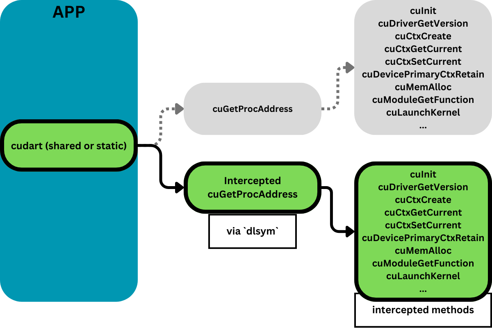

## CUDA Driver API Calls Interception

CUinterwarp implements the interception of CUDA Driver API calls.

***

#### Structure

It consists of 2 parts:
* core: the main functionality, where 
    * `interception` - is a simple interception library
    * `runner` - an aplication runner (adds `LD_PRELOAD` to an Env, and calls an app)
* example: cuBLAS application from Nvidia doc

#### Usage
* Clone the repository
* Navigate to the build directory: mkdir build && cd build
* Run CMake: cmake ..
* Build the project: make -j16
* Run the interception runner with the example application: 
    `./out/interception_runner ./out/example_app`
* Output:
```
Interception runner start()
Symbol is empty
Intercepted method: cuDriverGetVersion, result: 0
Intercepted method: cuInit, result: 0
Intercepted method: cuDeviceGet, result: 0
...

Intercepted method: cuModuleGetFunction, result: 0
Intercepted method: cuLaunchKernel, result: 0
Intercepted method: cuLaunchKernel, result: 0
    1      6     11     16     21     26
    2      7     12     17     22     27
    3   1536    156    216    276    336
    4    144     14     19     24     29
    5    160     15     20     25     30
Interception runner end()
```
***
#### Background
CUDA 11.3 introduced a method `cuGetProcAddress` - a CUDA Driver API function used to dynamically load a function pointer by name.

This method can be used to intercept CUDA Driver API methods, such as `cuInit`, `cuMemAlloc`, etc., regardless of whether `cudart` is linked statically or dynamically.

<br/>
<br/>
<p>

</p>

***
Tested on:
* CUDA's cublas project: https://docs.nvidia.com/cuda/cublas/#example-code
* My CUDA-tree project: https://github.com/fatlipp/cuda-tree

***
#### Further development:
* Implementing functionality to access remote GPU to perform computations (like rCUDA)

***
#### Compatibility
 * Tested on CUDA 12.2. If you encounter any issues with earlier versions, please let me know (uycsdb@gmail.com, [LinkedIn](https://www.linkedin.com/in/fatlip/)).
